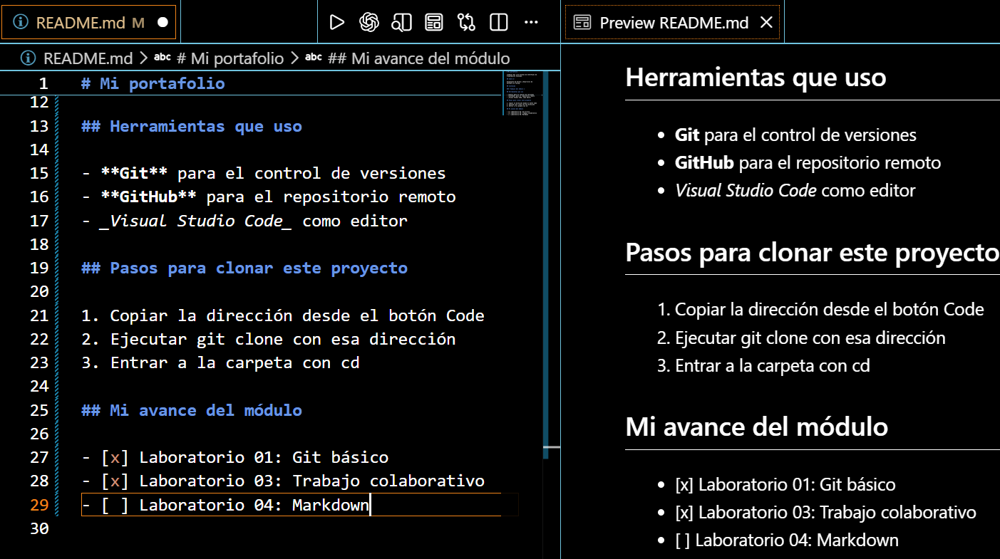

# Guía del Laboratorio 03: Trabajo colaborativo con GitHub

Esta guía explica cómo colaborar en un repositorio mediante un fork, Issues y Pull Requests.

## Descripción del trabajo

En este laboratorio practicamos cómo proponer cambios y comunicar problemas en un proyecto compartido.

### Herramientas necesarias

- Git instalado y configurado.
- Una cuenta de GitHub.
- Visual Studio Code.
- Conexión a Internet.

## Pasos para colaborar

1. Abrir el repositorio del docente en GitHub.
2. Crear un fork para tener una copia en mi cuenta.
3. Clonar mi fork en la computadora.
4. Crear una rama para realizar los cambios.
5. Modificar los archivos y guardar los cambios con un commit.
6. Subir la rama a mi fork con push.
7. Abrir un Pull Request hacia el repositorio del docente para proponer los cambios.

### Comunicar problemas con Issues

Los Issues permiten reportar errores o proponer mejoras. Cada uno debe tener un título claro y una descripción que explique lo que se necesita.

## Comandos de apoyo

Antes de guardar una versión, uso `git status` para revisar los archivos modificados.

### Ejemplo para publicar una rama

En este ejemplo, la rama se llama mejora-documentacion.

```bash
git switch -c mejora-documentacion
# Editar y guardar los archivos antes de continuar.
git add .
git commit -m "Mejora la documentación del proyecto"
git push -u origin mejora-documentacion
```

### Función de cada comando

| Comando       | Para qué sirve                          |
| ------------- | --------------------------------------- |
| git status    | Muestra el estado de los archivos.      |
| git switch -c | Crea una rama y cambia a ella.          |
| git add .     | Prepara los cambios para el commit.     |
| git commit    | Registra una versión de los cambios.    |
| git push      | Sube los commits al repositorio remoto. |

## Lista de verificación

- [x] Crear mi fork del repositorio.
- [x] Abrir dos Issues con descripciones claras.
- [x] Abrir dos Pull Requests con los cambios propuestos.

## Enlace de consulta

[Documentación de GitHub](https://docs.github.com/es)

## Evidencia del trabajo


